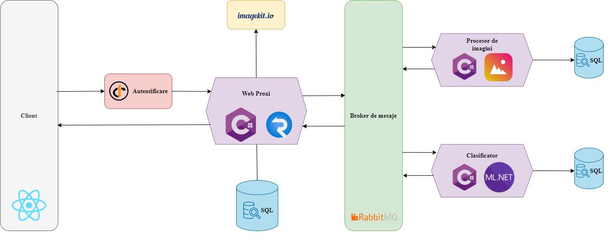
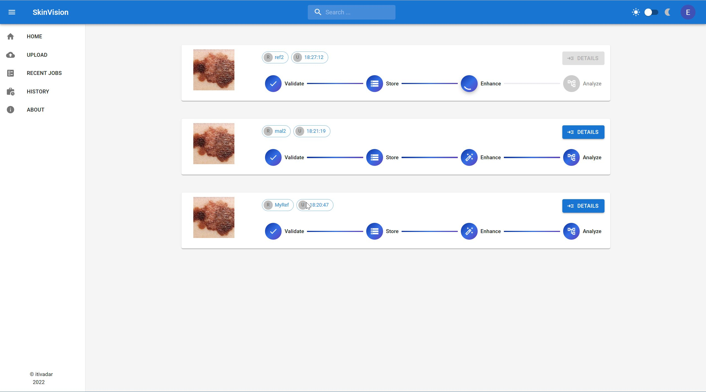
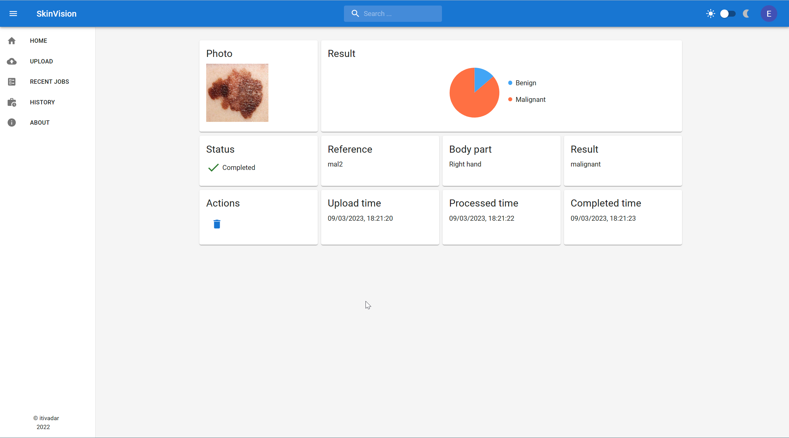
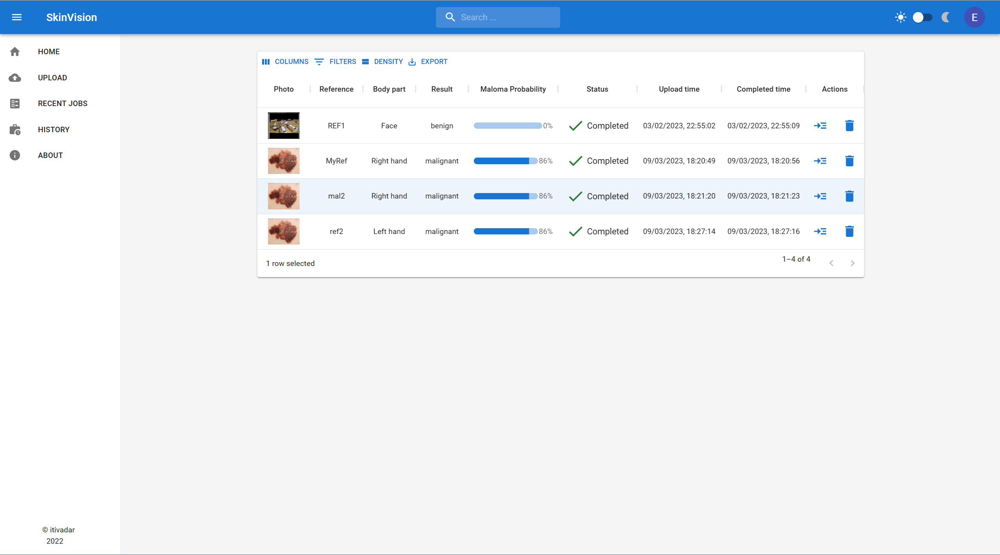
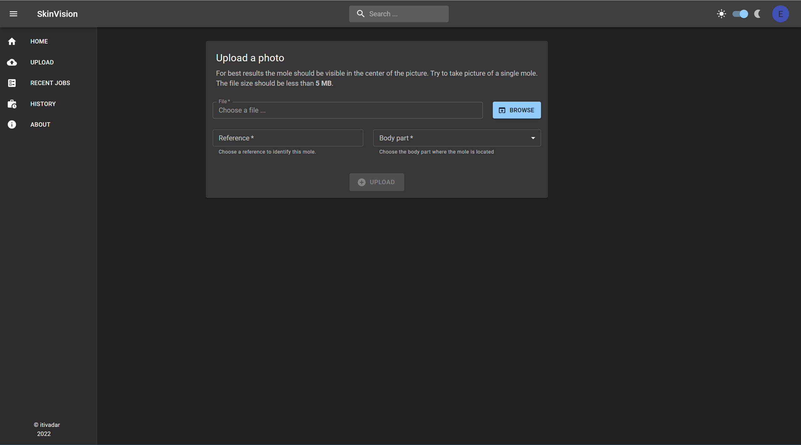

# Skin cancer detection system using Machine Learning

The solution implemented for early detection of the skin cancer. It allows user to upload photos of their skin moles in order to be checked for skin cancer detection using machine learning algorithms. The outcome would be a pro probability for that mole to become skin cancer.

The arhicterture of the system is based on microservices and the accuracy of the system is 84,8%. 

 The application features a page for displaying real-time processing progress of each photo, a page for history information and of course dark theme!

The technologies used were 
* C# for back-end, 
* React for front-end
* Material UI 
* ML .NET
* MediatR
* RabbitMQ
* SignalR
* CAP library
* RabbitMQ
* SQL
* ImageSharp

Please note that this repo does not contains the source code of the whole system. 

## Work-flow 

## System Design 
The systems consists of multiple micro-services:

* __Web application__
     * Provides the UI interface, authorization and authentication for user requests. 

* __Image processing service__
    * Enhance the image quality by applying the Gray World Algorithm to the uploaded photos.

* __The machine learning service__
    * Uses the trained model to classify the user pictures.

* __RabbitMQ (external service)__
     * Provides communication abilities between all the other components.
     * Communication between micro-services is done using events 
* __imagekit.io (external service)__

    * External service which provides storage for uploaded photos. Offer access to the data for all the microservices. 

Each micro-service manages a single functionality and it can be hosted independently of the others. Communication between components is done through a message broker. The client can access the system with the front-end application which is loaded in the browser. The front-end application is compatible with devices with small screen size.

The system architecture:

## The machine learning model 

The machine learning model (including training and consuming the model) was implemented using [ML. NET](https://dotnet.microsoft.com/en-us/apps/machinelearning-ai/ml-dotnet) library. 

The dataset used for training & validation is [HAM10000, a large collection of multi-source dermatological images of common pigmented skin lesions](https://dataverse.harvard.edu/dataset.xhtml?persistentId=doi:10.7910/DVN/DBW86T). 

The number of photos used is 2940 divided into two classes: malignant and benign with about the same number of photos in each class.

|Class|Photos count|
|--|--|
|``malignant``| 1433|
|``benign``| 1507|
|total|2940

The proportion between training and validation sets was 80:20.

## See the progress in real-time 

The user can see the progress of the photos through the processing pipeline. There are four steps until the results are done. The steps which are completed are marked by a blue check, the current one is marked by a spinning circle and the future steps are shown in gray. 

* Validate > The uploaded file is check against predefined conditions (size, type, etc. ). Implemented by the Web App service. 

* Store > The file is uploaded to the external storage provided by the imagekit.io. Implemented by the Web Appp service.

* Enhance > We apply a filter on the photo to improve brightness. Implemented by the Image Processing Service. 

* Analyze > A model trained by machine learning classify the photos in one of the classes: malignant or benign. The Machine Learning service is responsable for this step.

The implementation of the page can be possible because of the Event-Driven Design of the micro-services. The communication follows the Pub / Sub pattern to provide decoupling for each micro-service. The RabbitMQ is the broker message which acts as the infrastructure for communications. 

## Details page

User can see information about the results of classification along with other information on the details page. The page contains a thumbnail of the user's photo and a pie chart representing the probability ratio between the two classes (malignant and benign).
The output of a machine learning model is an array of probabilities assign to each class. The result of classification is the class with the highest probability. 

## History page

One of the most important aspect of detecting skin cancer is the evolution in time of the skin mole. An increase in size might be a sign that further investigations are needed. To help users track the evolution of their skin moles, I created the history page where all the uploaded photos can be viewed. 
Search functionality is provided for the history page.

## Loving dark theme 
Of course, the application features a cool looking dark theme.

